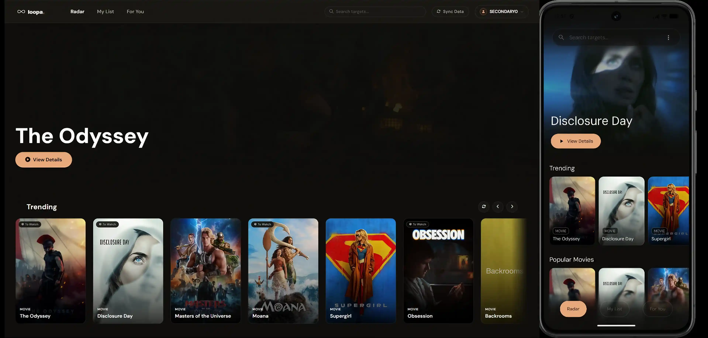
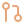

<div align="center">
  <br>
  

  <blockquote>
    <p><b>Discover Your Next Obsession.</b></p>
    <p><i>The Cinematic, Cross-Platform Media Tracker - Powered by AI.</i></p>
  </blockquote>

  
  <br><br>

  [](#)
  [](#)
  [](#)
  [](#)
  [](#)
  [](#)

  <br>

  [**Explore the Web App**](https://loopa1.netlify.app/) &nbsp;|&nbsp; [**Download Android APK**](https://github.com/Dragonballsuper-1995/loopa/releases)

  *Mirrors: [Vercel](https://loopa1.vercel.app/) | [GitHub Pages](https://dragonballsuper-1995.github.io/loopa/)*

  <br>

</div>

---

## Table of Contents

- [What is Loopa?](#what-is-loopa)
- [Key Features](#key-features)
- [Architecture & Tech Stack](#architecture--tech-stack)
- [Data Flow & Synchronization](#data-flow--synchronization)
- [AI Recommendation Engine](#ai-recommendation-engine)
- [Design System](#design-system)
- [Project Structure](#project-structure)
- [Getting Started](#getting-started)
- [Contributing](#contributing)

---

##  What is Loopa?

**Loopa** is a premium, cross-platform media tracking application built for people who take their watchlists seriously. It gives you a unified command center to seamlessly log **movies**, **TV shows**, and **anime** — and then harnesses the intelligence of **Google Gemini** to tell you exactly what to watch next.

The experience is designed to feel like the opening credits of an action thriller. Loopa abandons visual clutter and generic Material components entirely, in favor of a **cinematic, dark-first, minimalistic design language**. A deep charcoal canvas, high-voltage amber accents, stark angularity, and crisp hard-shadow elevation deliver a user experience that feels unmistakably premium.

Under the hood, Loopa is architected for resilience. A battle-tested **Offline-First, Last-Write-Wins (LWW) synchronization protocol** ensures your data is always captured locally first and reconciled with the cloud gracefully — whether you're on a subway, a plane, or a remote cabin.

> **Current Version: `v2.0.0`** — The Data Portability, AI Semantic Search & Clean Architecture release. Complete cross-platform sync, 1-click multi-format import/export, and natural language semantic discovery.

---

##  Key Features

| Feature | Description |
| :--- | :--- |
|  &nbsp; **AI Semantic Smart Search** | Discover media using natural language, vibe, plot description, or aesthetic (e.g., *"dystopian movie with synthwave soundtrack"*). Powered by Gemini 2.5 Flash Lite + Groq edge reasoning. |
|  &nbsp; **1-Click Data Portability** | Universal JSON & RFC 4180 CSV export + full import support for **Letterboxd**, **IMDb**, **MyAnimeList XML**, and **Trakt.tv** with automatic TMDB/Jikan metadata enrichment. |
|  &nbsp; **Realtime Cross-Device Sync** | Instant bi-directional synchronization via Supabase Realtime subscriptions. Log something on the web and watch it appear on your Android device in real time. |
|  &nbsp; **Offline-First Resilience** | A robust LWW conflict resolution engine. Data is persisted locally first (`Room DB v9` with indices / IndexedDB `IDBStore`), queued if offline, and flushed on reconnection. |
|  &nbsp; **Unified Media Universe** | Track movies, multi-season TV shows with per-episode logging, and anime — all from a single, unified interface powered by **TMDB**, **AniList**, **Kitsu**, and **Jikan**. |
|  &nbsp; **Cinematic Dark Mode UI** | A strictly dark-mode-only interface featuring custom design tokens, DM Sans typography, amber accents, and hard directional shadows. |
|  &nbsp; **Installable Web PWA** | Fully compliant Progressive Web App with Web App Manifest, Service Worker (`sw.js` cache-v8), offline fallback, and `IntersectionObserver` rendering. |
|  &nbsp; **Modular Jetpack Compose UI** | Decoupled, production-grade Android UI architecture with dedicated modules (`PosterCards`, `SearchScreen`, `MyListsScreen`, `SettingsScreen`, `DataPortabilityManager`). |
|  &nbsp; **Secure Multi-LLM Edge Proxy** | Hardened Cloudflare Worker routing requests to Gemini 2.5 Flash Lite, Groq (GPT OSS 120B), and OpenRouter with 24h edge caching. |

---

##  Architecture & Tech Stack

Loopa is a unified system bridging a Native Android application and a high-performance Progressive Web App, both backed by a real-time cloud database and a secure edge AI proxy.

```
┌─────────────────────────────────────────────────────────────────┐
│                         LOOPA ECOSYSTEM                         │
│                                                                 │
│   ┌──────────────────┐         ┌──────────────────────────┐     │
│   │  Android Client  │         │      Web Client (PWA)    │     │
│   │                  │         │                          │     │
│   │  Kotlin +        │         │  HTML5 + Vanilla JS +    │     │
│   │  Jetpack Compose │         │  Tailwind CSS (Static)   │     │
│   │  Room DB (v9)    │         │  IndexedDB (IDBStore)    │     │
│   │  DataPortability │         │  Portability Engine      │     │
│   │  PendingOpEntity │         │  Service Worker (sw.js)  │     │
│   └────────┬─────────┘         └───────────┬──────────────┘     │
│            │                               │                    │
│            └──────────────┬────────────────┘                    │
│                           │                                     │
│                ┌──────────▼──────────┐                          │
│                │      SUPABASE       │                          │
│                │  PostgreSQL 15+     │                          │
│                │  GoTrue Auth        │                          │
│                │  Realtime (WS)      │                          │
│                │  PostgREST REST API │                          │
│                └──────────┬──────────┘                          │
│                           │                                     │
│              ┌────────────▼──────────────┐                      │
│              │    Cloudflare Worker      │                      │
│              │    (loopa-ai-proxy)       │                      │
│              │    Fast & Semantic API    │                      │
│              └────────────┬──────────────┘                      │
│                           │                                     │
│                ┌──────────▼───────────┐                         │
│                │  Gemini 2.5 / Groq   │                         │
│                └──────────────────────┘                         │
└─────────────────────────────────────────────────────────────────┘
```

###  1. Native Android Client

Built entirely natively using modern Android architecture — no cross-platform compromise, no generic Material 3 defaults.

| Layer | Technology |
| :--- | :--- |
| **UI Framework** | Kotlin + Jetpack Compose (Modular `PosterCards`, `SearchScreen`, `MyListsScreen`, `SettingsScreen`) |
| **Architecture Pattern** | MVVM with `StateFlow` and Coroutines/Flow |
| **Local Persistence** | Room Database (v9) with indices (`listName`, `mediaType`, `updatedAt`) + `PendingOpEntity` |
| **Data Portability** | `DataPortabilityManager` (JSON, CSV, Letterboxd, IMDb, MAL XML, Trakt) |
| **Networking** | Supabase Android SDK (PostgREST, Auth, Realtime) + Retrofit/Moshi Edge API |
| **Media APIs** | TMDB, Jikan, AniList, Kitsu via parallel async hydration |

###  2. High-Performance Web App (PWA)

A lightweight, zero-bundler web experience engineered for speed, offline resilience, and maximum fluidity.

| Layer | Technology |
| :--- | :--- |
| **Core** | HTML5 + Vanilla JavaScript (No bundler, no framework overhead, < 200 KB total footprint) |
| **Styling** | Tailwind CSS — **compiled statically at build time** to `output.css` |
| **Storage Engine** | Asynchronous IndexedDB (`IDBStore`) with auto-migration from legacy `localStorage` |
| **Data Portability** | `LoopaPortability` client engine (JSON, CSV, Letterboxd, IMDb, MAL XML, Trakt) |
| **Offline Caching** | Service Worker (`sw.js` cache-v8) with offline navigation fallback |
| **Virtual Rendering** | `IntersectionObserver` API for progressive Watchlist DOM rendering |
| **Sync Client** | Supabase JS SDK + Realtime single-row sync + Edge Fast/Semantic API |

###  3. Backend & Cloud Infrastructure

| Service | Role |
| :--- | :--- |
| **Supabase (PostgreSQL 15+)** | Primary database, user authentication (GoTrue), and Realtime WebSocket subscriptions |
| **Supabase Realtime** | Broadcasts `INSERT/UPDATE/DELETE` events to all connected clients for live cross-device sync |
| **Supabase Auth (GoTrue)** | Email-based authentication with Row-Level Security (RLS) policies |
| **Cloudflare Worker** (`loopa-ai-proxy`) | Edge proxy — `/api/search/fast`, `/api/search/semantic`, `/api/media/details`, `/api/recommendations` |
| **Multi-LLM Pipeline** | Gemini 2.5 Flash Lite + Groq (GPT OSS 120B) + OpenRouter fallback |
| **Media APIs** | TMDB, AniList, Kitsu, and Jikan |

---

##  Data Flow & Synchronization

Loopa's offline-first protocol is a core pillar of the architecture. The entire flow is designed around the guarantee that **a user action is never lost**, regardless of network state.

```
User Action
    │
    ▼
Local Write (Instant)
├── Android: Room DB (INSERT / UPDATE)
└── Web:     Memory State + drawerDBEntry
    │
    ▼
Network Mutation Attempt ───────────────────────────────────┐
    │                                                       │ FAIL
    │ SUCCESS                                               ▼
    ▼                                                Offline Queue
Supabase REST / PostgREST                 ├── Android: PendingOpEntity (Room)
    │                                     └── Web:     loopa_sync_queue (LocalStorage)
    ▼                                                       │
Realtime Broadcast ◄────────── Reconnection Flush (FIFO) ◄──┘
    │                                 (ConnectivityManager / window.ononline)
    ▼
All Connected Clients Updated
```

### Conflict Resolution: Last-Write-Wins (LWW)

When a queued operation is flushed to Supabase on reconnection, the system compares the operation's local `timestamp` against the server's `updated_at` column:

| Scenario | Outcome |
| :--- | :--- |
| Local timestamp is **newer** than server | Operation is applied to Supabase |
| Server timestamp is **newer** than local | Queued operation is discarded (server wins) |
| Timestamps are **equal** | No-op |

This symmetrical LWW strategy prevents data corruption when multiple devices write the same record concurrently while offline.

---

##  AI Recommendation Engine

The AI feature is a full pipeline — not just a simple chat prompt.

```
1. CONTEXT CONSTRUCTION
   Client assembles: watched list + genres + ratings + current interaction

       │
       ▼

2. EDGE PROXY DISPATCH
   Request sent to Cloudflare Worker (loopa-ai-proxy)
   API Key never touches the client browser or Android app

       │
       ▼

3. GEMINI API CALL
   Worker proxies request securely to Google Gemini

       │
       ▼

4. STRUCTURED RESPONSE
   Gemini returns strictly typed JSON:
   {
     "title":       "...",
     "mediaType":   "movie | tv | anime",
     "genre":       "...",
     "releaseYear": "...",
     "reasoning":   "..."
   }

       │
       ▼

5. PARALLEL POSTER HYDRATION
   Client fires concurrent async requests to TMDB + Jikan
   to fetch poster images and canonical IDs for all recommendations
```

Each recommendation is immediately actionable — pre-hydrated with real poster art and a direct path to add it to your watchlist.

---

##  Design System

Loopa's visual identity is a **single source of truth**, shared pixel-perfectly across both the web (`Tailwind CSS` config) and Android (`Compose` theme).

> The design reads like the opening credits of an action thriller. The classic Hollywood contrast trick: **Amber accents on a deep charcoal base** — sharp, angular, and uncompromising.

### Color Tokens

| Token | Hex | Usage |
| :--- | :--- | :--- |
| `loopBase` | `#0F0E0C` | Primary canvas / page background |
| `loopSurface` | `#1A1915` | Cards, containers, modals |
| `loopRaised` | `#242320` | Hover states, elevated elements, inputs |
| `loopAmber` | `#E8A87C` | **Primary brand accent**, CTAs, active states |
| `loopAmberStrong` | `#D4845A` | Pressed states, gradient terminus |
| `loopAmberSubtle` | `#2A1F17` | Chip/tag backgrounds, amber containers |
| `textPrimary` | `#F0EDE8` | Headlines, primary UI text |
| `textSecondary` | `#A09990` | Labels, metadata, secondary text |
| `textMuted` | `#5C574F` | Captions, placeholders, disabled text |
| `loopSuccess` | `#7AB87A` | Watched / completed state |
| `loopError` | `#C87070` | Error, delete, danger actions |

### Typography

**Font Family: `DM Sans`** — exclusively. `BebasNeue` has been fully deprecated.

| Style | Size | Weight |
| :--- | :--- | :--- |
| Display Large | `48sp` | Bold (700) |
| Headline Large | `26sp` | SemiBold (600) |
| Title Large | `16sp` | SemiBold (600) |
| Body Large | `16sp` | Normal (400) |
| Label Medium | `11sp` | Medium (500) |

### Elevation & Layout Principles

- **Shadows**: Hard, directional, solid-color drop shadows — no soft feathered blurs.
- **Borders**: Opacity-modulated hairlines on `textPrimary` (`7%` subtle → `20%` focus ring).
- **Border Radii**: `14px` cards, `10px` inputs, `20px` dialogs, `999px` pills.
- **Grid**: Masonry and poster-driven grid layouts. Tight vertical spacing for visual cohesion.
- **Dark Mode**: The **only** supported mode. Light mode is intentionally excluded to preserve the cinematic aesthetic.

---

##  Project Structure

```text
loopa/
├── app/                          # Android Native Project (Kotlin/Compose)
│   └── src/main/java/com/loopa/
│       ├── db/                   # Room entities, DAOs, Migrations
│       │   ├── MediaItemEntity
│       │   ├── PendingOpEntity   # Offline operations queue
│       │   └── WatchedEpisodeEntity
│       ├── model/                # Remote DTOs (RemoteMediaItem, RemoteWatchedEpisode)
│       ├── network/              # API Services (TMDB, Jikan, Supabase setup)
│       ├── repository/           # Offline-first repositories (sync orchestration)
│       ├── ui/                   # Jetpack Compose Screens & Theme
│       └── viewmodel/            # StateFlow management (MVVM)
│
├── website/                      # Web Frontend (HTML/JS/CSS)
│   ├── index.html                # Main SPA interface
│   ├── output.css                # Compiled Tailwind CSS (static build artifact)
│   └── js/
│       ├── api.js                # Edge Search & TMDB/AniList/Jikan API integrations
│       ├── app.js                # App state, listeners, view switching
│       ├── search-engine.js      # Client-side Trie fuzzy index & search engine
│       ├── sw.js                 # Service Worker (stale-while-revalidate offline caching)
│       ├── supabase.js           # Supabase DB operations & offline sync queue
│       └── ui.js                 # DOM manipulation & component generation
│
├── ai-proxy-worker/              # Cloudflare Worker (loopa-ai-proxy)
│
└── docs/                         # Core Project Documentation
    ├── ARCHITECTURE.md           # System architecture blueprint
    ├── CONTEXT.md                # Executive summary & platform analysis
    ├── DESIGN.md                 # Visual identity & design tokens
    └── MEMORY.md                 # Session state & milestone tracker
```

---

##  Getting Started

### Prerequisites

Before running Loopa locally, provision the following services:

| Service | What You Need |
| :--- | :--- |
| [Supabase](https://supabase.com) | Project `URL` and `ANON_KEY`. Enable Email Auth. |
| [TMDB](https://www.themoviedb.org/settings/api) | API Key (v3 auth) |
| [Cloudflare Workers](https://workers.cloudflare.com/) | Deploy `ai-proxy-worker/` with your Gemini API Key as a Worker Secret |
| [Google Gemini](https://ai.google.dev/) | API Key (stored as a Cloudflare Worker secret — **never** client-side) |

###  Running the Web App

```bash
# 1. Navigate to the website directory
cd website

# 2. Configure your API keys in js/config.js
#    (Supabase URL, Supabase Anon Key, TMDB Key, AI Proxy URL)

# 3. Serve locally — any static file server works
python -m http.server 8000
# OR
npx serve .
```

Open `http://localhost:8000` in your browser.

###  Running the Android App

```bash
# 1. Open the /app directory in Android Studio (Hedgehog or newer)

# 2. Create local.properties in the project root:
#    SUPABASE_URL=https://your-project-id.supabase.co
#    SUPABASE_ANON_KEY=your-anon-key
#    TMDB_API_KEY=your-tmdb-key
#    AI_PROXY_URL=https://loopa-ai-proxy.your-worker.workers.dev

# 3. Sync Gradle and build
./gradlew assembleDebug

# 4. Install on a connected device or emulator
adb install app/build/outputs/apk/debug/app-debug.apk
```

> For a pre-built APK, grab the latest release from the [GitHub Releases page](https://github.com/Dragonballsuper-1995/loopa/releases).

###  Deploying the AI Proxy Worker

```bash
# 1. Navigate to the worker directory
cd ai-proxy-worker

# 2. Install Wrangler CLI
npm install -g wrangler

# 3. Authenticate with Cloudflare
wrangler login

# 4. Store your Gemini API key as a secret (never in plaintext)
wrangler secret put GEMINI_API_KEY

# 5. Deploy to the Cloudflare edge
wrangler deploy
```

---

##  Contributing

Contributions are welcome. Before opening a pull request, please read the documentation in the `/docs` directory to align with the established architecture and design system.

**Key rules:**
- The design system (`DESIGN.md`) is the **single source of truth** - do not introduce ad-hoc colors, fonts, or shadow styles.
- All data writes must go through the offline-first flow (local persistence first, then network).
- Android UI must use the defined Compose theme tokens, not raw hardcoded values.
- Open an issue first to discuss significant features or architectural changes.

---

<br>

<div align="center">
  
  <br>
  <sub>Built with obsession by <b>Dragonballsuper-1995</b>.</sub>
  <br><br>
  <sub>
    <a href="https://loopa1.netlify.app/">Web App</a> &nbsp;•&nbsp;
    <a href="https://github.com/Dragonballsuper-1995/loopa/releases">Android APK</a> &nbsp;•&nbsp;
    <a href="https://loopa-4e92d.web.app/">Firebase Mirror</a> &nbsp;•&nbsp;
    <a href="https://loopa1.vercel.app/">Vercel Mirror</a> &nbsp;•&nbsp;
    <a href="https://dragonballsuper-1995.github.io/loopa/">GitHub Pages Mirror</a>
  </sub>
</div>
