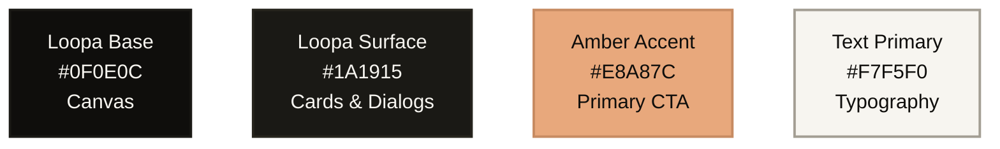

# LOOPA — Brand Identity & Design System

Welcome to the official Brand Identity Guide for **Loopa**. This document establishes the visual style, color scheme, typography guidelines, and design principles to ensure a premium, clean, and cohesive experience across the web and mobile applications.

---

## 1. Brand Essence & Story

### The "Loopa" Metaphor
**Loopa** represents continuous flow, elegant tracking, and warmth. 
*   **The Vibe**: Clean, simple, and minimal. We moved away from aggressive, "techy" neon colors and harsh angles in favor of organic shapes, warm tones, and high legibility.
*   **The Aesthetic**: A blend of premium editorial design and modern functional app design (reminiscent of brands like MyMind or modern native OS surfaces).

---

## 2. Color System

Loopa utilizes a deeply warm, dark-mode-first color scheme that feels like a cozy, premium screening room. We avoid pure, harsh blacks (`#000000`) and pure whites (`#FFFFFF`), leaning entirely into soft, warm undertones.

### Color Tokens

| Token | Hex Value | Role | Visual Purpose |
|:---|:---|:---|:---|
| `Base` | `#0F0E0C` | Primary Canvas | The main app and website background. A very dark, warm, brown-tinted black. |
| `Surface` | `#1A1915` | Elevated Container | Used for cards, bottom sheets, and navigation bars. |
| `Amber` | `#E8A87C` | Primary Accent / CTA | A soft, golden-orange used for active states, primary buttons, and the logo mark. |
| `Border` | `#26241D` | Dividers | Very subtle, warm borders used to separate items without heavy shadows. |
| `TextPrimary` | `#F7F5F0` | Core Text | Soft, off-white for all primary reading material and headers. |
| `TextSecondary` | `#A39E93` | Muted Text | A warm grey for metadata, descriptions, and passive icons. |

---

## 3. Logo & Iconography

*   **The Logo**: A clean, organic representation of an infinity loop/playhead (Concept 5), utilizing the `Amber` brand color. It avoids unnecessary text (like "concept") and relies purely on the geometric mark and the lowercase `loopa` wordmark.
*   **Iconography**: Rounded, filled icons (e.g., Material Icons Rounded) that match the friendly, accessible nature of the brand.

---

## 4. Typography System

The entire brand is built around **DM Sans**, a geometric sans-serif that is incredibly clean, modern, and highly legible. We favor lowercase styling for a friendly, approachable, and minimal feel.

| Role | Font Family | Weight | Case Preference | Purpose |
|:---|:---|:---|:---|:---|
| **Logo / Wordmark** | `DM Sans` | `Bold` (700) | lowercase (`loopa`) | Brand recognition. |
| **Page Headers** | `DM Sans` | `SemiBold` (600) | Title Case | Screen titles (e.g., "discover", "for you"). |
| **Body / Labels** | `DM Sans` | `Medium` (500) | Sentence Case | Standard UI labels, buttons, and descriptions. |
| **Metadata** | `DM Sans` | `Regular` (400) | lowercase | Small tags, release years, etc. |

---

## 5. UI Layout & Component Guidelines

To support the minimal and warm brand feel, all UI elements must adhere to these structural rules:

*   **Organic Geometry**: 
    *   **Pill Shapes**: Buttons, tags, and small interactive elements must use full pill-shaped rounding (`RoundedCornerShape(percent = 50)`).
    *   **Card Shapes**: Larger surfaces (like movie posters and dialogs) use a generous, soft radius (e.g., `24dp`).
    *   *Rule: Brutalist, hard 90-degree corners and skewed/slanted angles are strictly forbidden.*
*   **Surface Elevation (Flat Design)**: 
    *   We do not use drop shadows (`elevation = 0.dp`). 
    *   Depth is achieved entirely through tonal color shifts (placing a `#1A1915` Surface on top of a `#0F0E0C` Base) and hairline 1dp borders (`#26241D`).
*   **Glassmorphism & Blurs**: 
    *   Sticky headers, bottom navigation bars, and overlays should utilize frosted glass effects (using `haze` in Compose or `backdrop-filter` in CSS) to let the warm canvas bleed through elegantly.
*   **Smooth Loading states**: 
    *   Instead of jarring loading spinners, use subtle, pulsating shimmer effects that map to the exact shape (pill or card) of the loading content.
